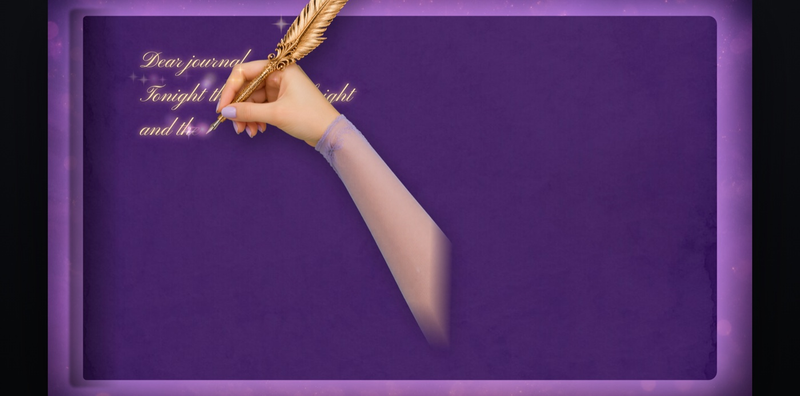
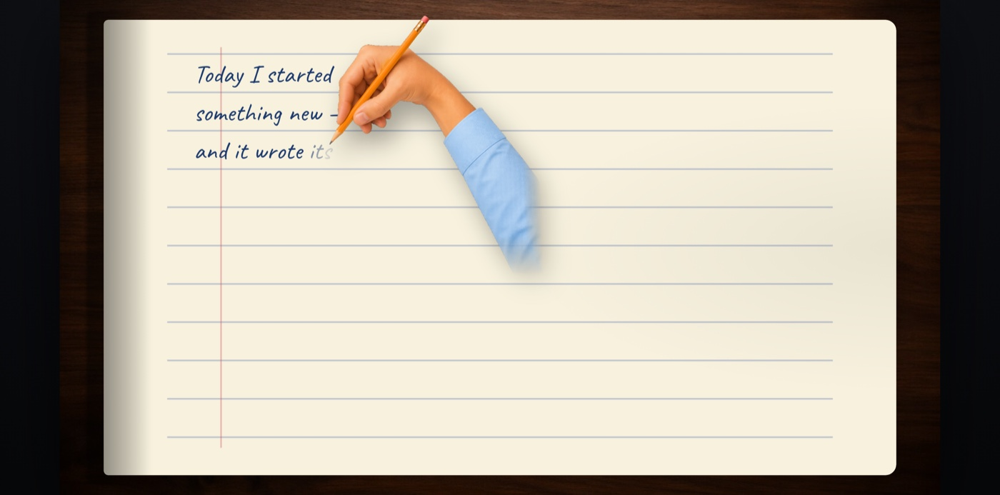
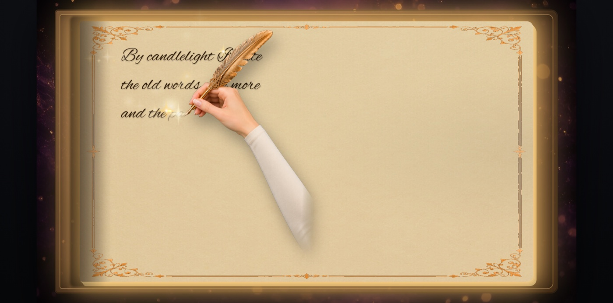
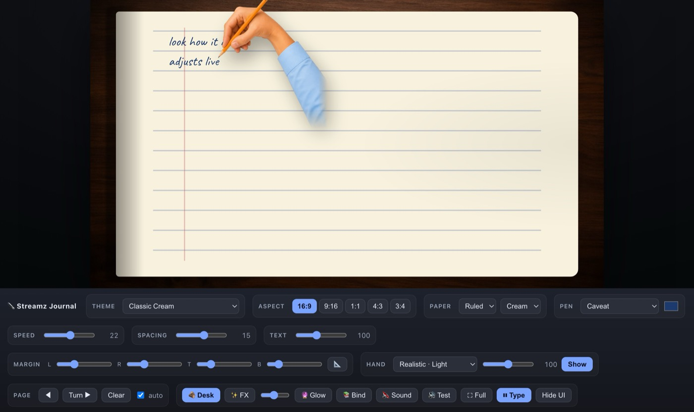
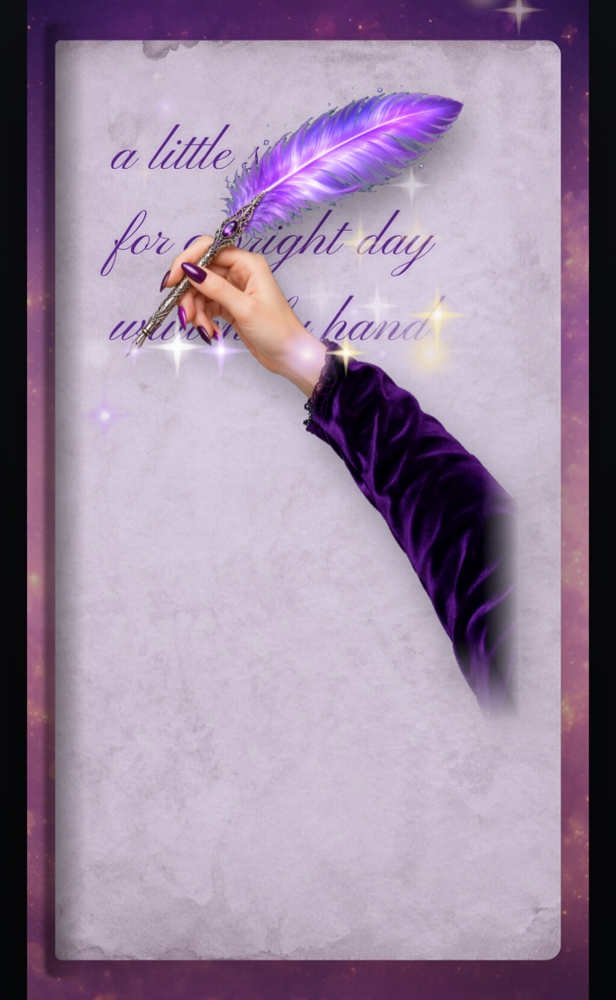

<div align="center">

# ✒️ Streamz Journal

### Type, and a hand writes it into a journal — live, on screen.

A single-file web app where an animated hand holding a pen or feather quill **"writes" your words** into a journal — real handwriting fonts, page-turns, magical sparkles, and a feather that flexes with spring physics. Made for streaming, fun on its own.

[](https://hanley-tech.github.io/streamz-journal/)
&nbsp;
[](LICENSE)

   

<br>



</div>

---

## ✨ What it does

You type into the page and the hand **writes it out**, letter by letter, in a handwriting font — wrapping lines, turning pages when one fills up, and flourishing each finished line with a little shimmer. Resize it to any streaming aspect ratio, hide the UI, and capture it in OBS. Or just doodle.

- 🪶 **Watch it write** — the hand tracks the text baseline and the feather flops with real spring physics
- 📖 **Auto page-turns** — fills a page, flips it, and carries your overflow forward so fast typing never runs off
- 🎨 **Totally themeable** — paper, pen, ink, hand, background, sounds, sparkles — all data-driven
- 📐 **Any aspect** — 16:9, 9:16, 1:1, 4:3, 3:4 — vertical or horizontal, for any platform
- ✨ **Magic FX** — nib sparkles, line-lock shimmers, a page glow, and writing/chime/page-turn sounds
- 💾 **Remembers everything** — your setup is saved to the browser and restored on reload
- 🪶 **Zero dependencies** — one `index.html`, no build, no server. Open and go.

<br>

## 🎬 Looks

<table>
  <tr>
    <td width="50%" valign="top">
      <br>
      <b>Classic Cream</b> — ruled notebook, pencil, realistic hand on a wooden desk.
    </td>
    <td width="50%" valign="top">
      <br>
      <b>Hogwarts Spellbook</b> — gilt-bordered parchment tome with a feather quill.
    </td>
  </tr>
  <tr>
    <td width="50%" valign="top">
      <br>
      <b>Everything is a knob</b> — theme, aspect, paper, pen, speed, spacing, size, margins, hand, FX.
    </td>
    <td width="50%" valign="top" align="center">
      <br>
      <b>Vertical (9:16)</b> — drop it straight into a phone-shaped stream.
    </td>
  </tr>
</table>

<br>

## 🚀 Quick start

**[▶ Just open the live demo.](https://hanley-tech.github.io/streamz-journal/)** Click the page and start typing.

To run it locally, open **`index.html`** in a browser (double-click, or drag it into Chrome).

> Needs internet **once** to pull handwriting fonts from Google Fonts. To load your own theme packs (`themes/packs.js`), serve the folder with any static server (e.g. `python3 -m http.server`) since some browsers block sibling scripts on `file://`.

<br>

## ⌨️ Keyboard

| Key | Action |
|---|---|
| *(type)* | The hand writes your characters |
| **Enter** | New line (with a lock-in shimmer); text also auto-wraps |
| **Tab** | Turn the page |
| **Esc** | Pause / resume typing |
| **F9** | Hide / show the controls (clean capture) |
| **◀ / Resume** | Review previous pages, then return to live |

## 🎛️ Controls

| Control | What it does |
|---|---|
| **Theme** | One-click looks (paper + pen + hand + background + sound) |
| **Aspect** | Lock to 16:9, 9:16, 1:1, 4:3, or 3:4 |
| **Paper** | Ruled / grid / blank + color |
| **Pen** | Handwriting font + ink color |
| **Speed / Spacing / Text** | Chars-per-second, line spacing, and text size (independent) |
| **Margins** | L / R / T / B insets; bottom margin sets where the page auto-turns |
| **Hand** | Realistic / cartoon hand or feather quill, in 3 tones, size, show/hide |
| **✨ FX / 🔮 Glow / 📚 Bind** | Sparkles, animated page glow, bound-leather-tome look |
| **Sound / Full** | Writing + chime + page-turn audio; fullscreen |

Your settings persist to `localStorage` and restore on reload — a live stream survives a refresh.

<br>

## 🎨 Make your own theme

Everything is data-driven. Edit **[`themes/packs.js`](themes/packs.js)** (loaded automatically, fully commented) to add:

- `STREAMZ_THEMES` — paper, pen, hand, background, sound, sparkle palette, glow, bound-book frame, border texture
- `STREAMZ_HANDS` — a transparent PNG + the nib position (as a width/height fraction) + size, plus an optional feather `grip` line
- `STREAMZ_BACKGROUNDS` — image / gradient / none
- `STREAMZ_FONTS` — a Google Fonts URL or a self-hosted `@font-face`
- `STREAMZ_SFX` — your own writing / chime / page-turn sounds

Ships with the **✨ Yoyo the Witch** pack (feather quill, celestial palette, ink glow) as a complete worked example, plus the bound **Hogwarts Spellbook** tome.

<br>

## 📺 Streaming (OBS) & URL presets

Press **F9** to hide the UI, **Full** for fullscreen, then add a **Window/Browser Source** in OBS and crop to the frame. Preset everything via the URL — perfect for a Browser Source:

```
index.html?theme=yoyo&ar=9:16&font=Kalam&speed=14&paper=ruled&ink=%231c3a6e
```

`theme`, `ar`, `font`, `speed`, `paper`, `ink` (URL-encoded hex), `hand`, and `&demo` for sample text.

<br>

## 🌐 Deploy

Static files at the repo root — deploys anywhere:

- **GitHub Pages** — included. The workflow in `.github/workflows/pages.yml` publishes on push to `main` (one-time: **Settings → Pages → Source: GitHub Actions**).
- **Netlify / Vercel / Cloudflare Pages / S3** — drag-drop the folder; no build command.

## 🛠️ How it works

Plain HTML/CSS/JS in one file — no framework, no bundler. The hand is drawn to a `<canvas>` each frame, anchored to the live text baseline; the feather bends with a small spring-physics hinge. Sparkles are a lightweight particle system, the page-turn is a CSS 3D strip animation, and state persists to `localStorage`.

## 📜 Credits & license

- **Fonts** — [Google Fonts](https://fonts.google.com/) (Caveat, Dancing Script, Pinyon Script, Great Vibes, Alex Brush, …) under the SIL Open Font License.
- **Artwork** in `assets/` was generated with AI image tools for this project.
- The **Yoyo the Witch** pack palette is an homage to public branding of [@yoyothewitch](https://www.instagram.com/yoyothewitch/), provided as an example — no affiliation or endorsement implied.

Released under the **[MIT License](LICENSE)** © 2026 Hanley Leung.
